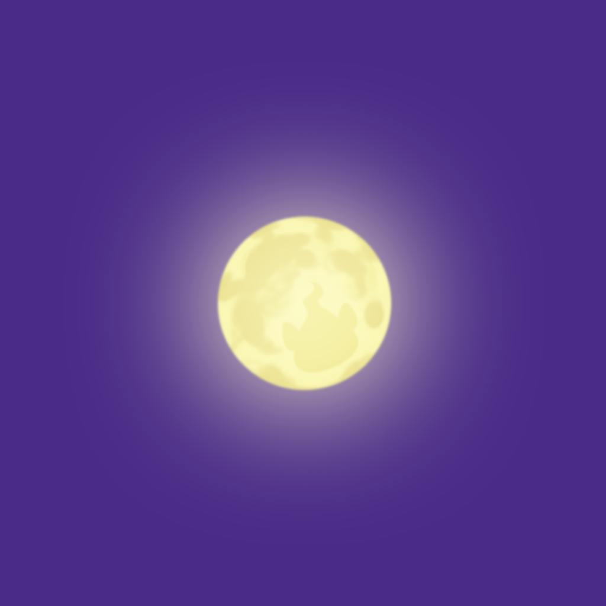
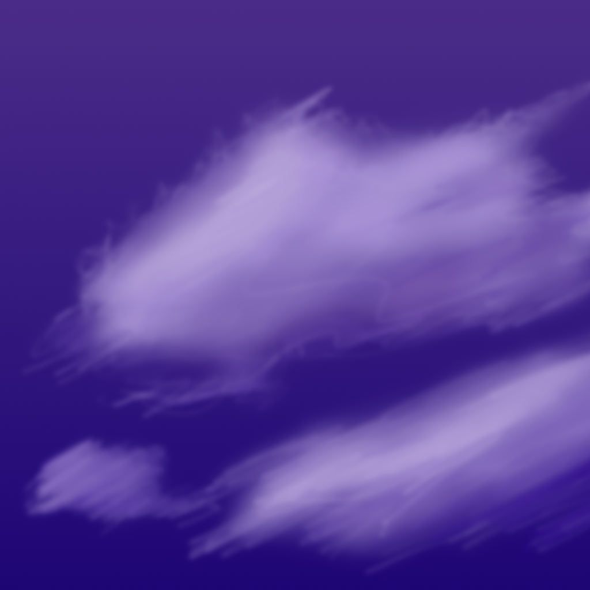
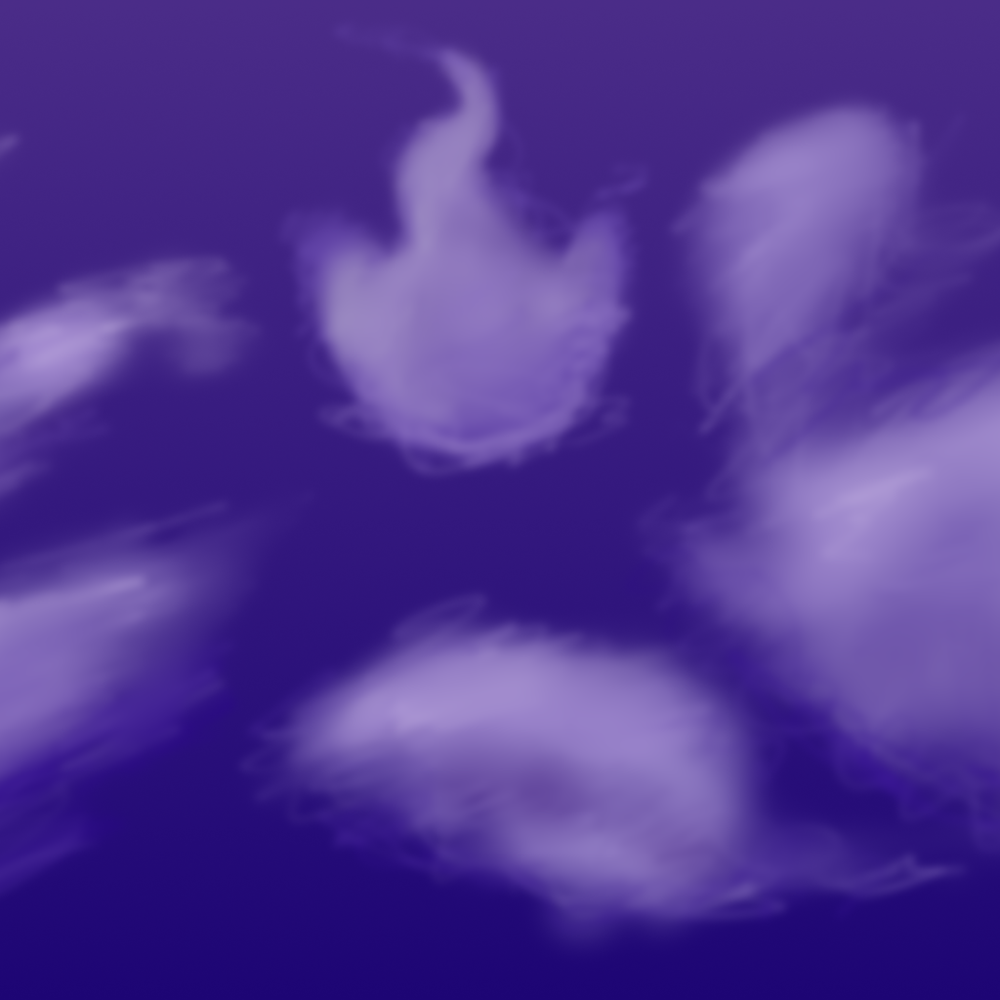
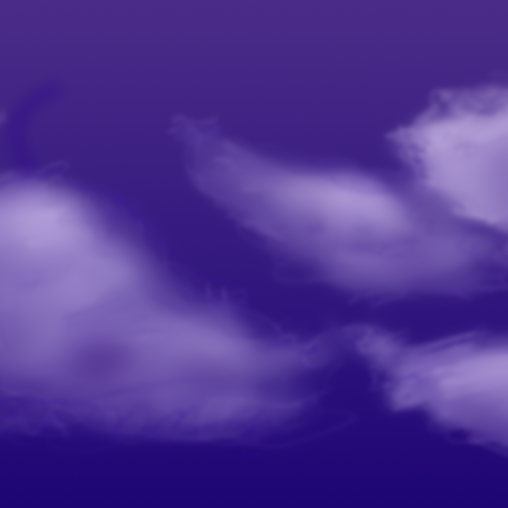
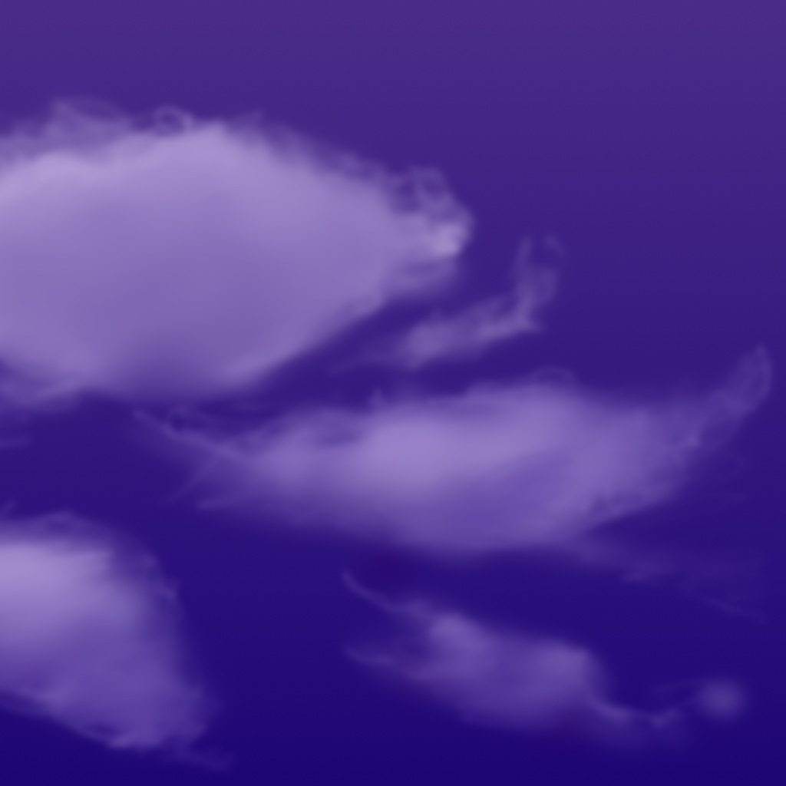

# AnimalAnima
TGS2017_アニマルアニマ‗ソースコード

## 田原担当箇所

もともと、2年生が担当していましたが、掛け持ちしていたプロジェクトの都合で、
本番の2週間前に急遽引継ぎとなりました。
企画自体が、夏休みの直前に動き出したので、TGSではなく、学内の卒業進級制作展への出展に向けてのゲームで、せっかくだからTGSにも出そうということで、出展いたしました。

2年生の担当した箇所をなるべく残しつつ……が難しく、移動とコントローラーの読み取り部分のみは2年生の部分を残してあります。

それ以外は田原が担当いたしました。

## プログラム以外

### Skybox
自作してみました。
SAI2で製作時間は1時間ほど。
雲の画像を参考として見つつ、１から描いています。
アニマの画像のみ加工して月に重ねています。

|  |  |  |  |
|:------------:|:------------:|:------------:|:------------:|
|  |  |  |  |
|  |  |  |  |
|  |  |  |  |

### 画像のパッキング

UI素材などをパッキングして軽量化を図りました。

### アニメーション

UIのアニメーション
デモ画面、アイテム説明デモ
アニマ、アイテムのPOP、アイドルのアニメーションをUnity上で作成。
